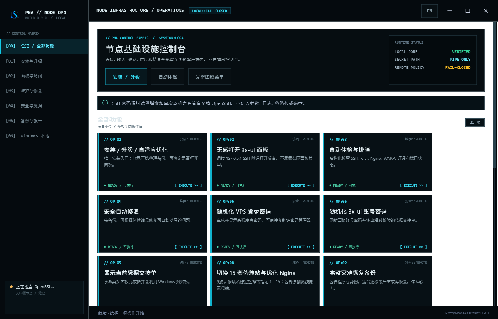
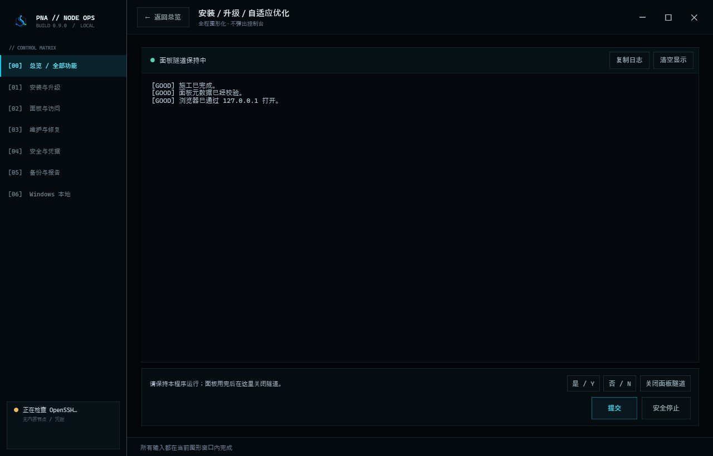

  

<h1 align="center">ProxyNodeAssistant v0.9.0</h1>

  面向 Windows 与 Android 的全图形 VPS 节点部署、维护、排障与恢复工具

  
  
  
  
  

  <a href="ProxyNodeAssistant-v0.9.0-从零部署教程.md">从零部署教程</a>
  ·
  <a href="ProxyNodeAssistant-v0.9.0-完整使用说明书.md">完整使用说明书</a>
  ·
  <a href="ANDROID.md">Android 手册</a>
  ·
  <a href="BUILD.md">构建说明</a>
  ·
  <a href="ProxyNodeAssistant-v0.9.0-更新说明.md">更新说明</a>

---

ProxyNodeAssistant 把原本分散在 SSH、SCP、PowerShell、Linux shell、3x-ui、Xray、Nginx、Certbot 和防火墙中的操作收敛成一个本地图形控制台。

Windows 版是原生 WPF 单 EXE；Android 版是 Kotlin + Jetpack Compose 原生应用。两端复用同一套 proxy-runbook v0.9.0，不依赖 Termux、Electron 或 WebView，也不会弹出一个黑色终端让用户自行猜下一步。

项目遵循三个原则：

- 隐私优先：共享包和源码不内置真实 VPS、域名、邮箱、账户、密码、私钥或交接单；
- 失败关闭：任何远端步骤失败后，不继续复制凭据、不继续打开面板、不把错误文本当成成功结果；
- 幂等施工：只有操作 1 能安装或升级；同版不重装，旧版升级，新版拒绝降级。

> 本项目用于管理你拥有或已获明确授权的服务器。使用者应遵守服务器所在地法律、服务商条款和网络服务规则。

## 界面

所有输入都在当前图形窗口内完成。SSH、sudo 或服务商 API 需要秘密时，界面会切换为遮罩输入；普通文本、Host Key 确认、Y/N、停止、日志和面板隧道生命周期也都有对应的图形控件。

## 谁适合使用

- 第一次购买 VPS、域名和使用 Cloudflare 的新手；
- 需要管理多台 Ubuntu/Debian 节点的个人用户；
- 希望每台 VPS 使用独立 SSH key、并能归档和恢复 key 的用户；
- 需要完整备份、轻量配置备份、诊断报告和全量拆除能力的维护者；
- 希望在 Windows 和 Android 使用同一操作模型的人。

如果你还没有 VPS 或域名，请从 [从零部署教程](ProxyNodeAssistant-v0.9.0-从零部署教程.md) 开始。里面包括 VPS 配置建议、域名商选择、微信/支付宝/银联支付方式核对、Cloudflare Nameserver、DNSSEC、灰云 A 记录和首次上线验收。

## 支持范围

| 组件 | 支持范围 |
|---|---|
| Windows 客户端 | Windows 10/11 x64、Windows 10 x86、Windows 10/11 ARM64 |
| Android 客户端 | 原生 Android universal APK，不依赖 Termux |
| VPS 系统 | Ubuntu、Debian |
| SSH | 密码临时会话、节点专属长期 Ed25519 key |
| 面板 | 3x-ui，通过本机 127.0.0.1 SSH 隧道访问 |
| 节点 | Xray VLESS + REALITY，24443 shadow 真机验货后再提升 |
| Web | Nginx、Let’s Encrypt、15 套无第三方依赖的伪装模板 |
| 路由 | WARP MASQUE、本地代理与可选持久路由 |
| 流量 | SSH/vnStat 估算、KiwiVM 和条件式服务商 API |

建议 VPS 至少具备 KVM、1 vCPU、1 GB 内存、10 GB 磁盘和独立公网 IPv4。新手推荐 Ubuntu 22.04 LTS 64 位或 Debian 12 64 位、2 GB 内存和 20 GB 磁盘。

## 从购买到上线

~~~mermaid
flowchart LR
    A[购买 KVM VPS] --> B[重装 Ubuntu / Debian]
    B --> C[购买域名]
    C --> D[接入 Cloudflare]
    D --> E[灰云 A 记录指向 VPS]
    E --> F[操作 1 安装 / 升级]
    F --> G[24443 真机验货]
    G --> H[保存凭据和 SSH key]
    H --> I[导入订阅并运行体检]
~~~

### 1. 准备 VPS

必须确认：

- 独立公网 IPv4，不是共享端口的 NAT VPS；
- root 或可 sudo 的普通用户；
- 可以使用 SSH；
- 入站 SSH、80/tcp、443/tcp 可用；
- 24443/tcp 只在安装验货期间临时使用；
- 服务商后台能重装系统、重置密码并进入救援 Console。

### 2. 准备域名和 Cloudflare

在 [Cloudflare Dashboard](https://dash.cloudflare.com/) 添加根域名，然后去域名注册商把权威 Nameserver 换成 Cloudflare 分配的两条。

若旧 DNS 提供商启用了 DNSSEC，必须先在注册商关闭旧 DNSSEC，再换 Nameserver；Cloudflare 状态变成 Active 后再重新开启。

添加记录：

| 字段 | 值 |
|---|---|
| Type | A |
| Name | cover 或其他自选子域名 |
| IPv4 | VPS 的真实公网 IPv4 |
| Proxy status | DNS only |
| TTL | Auto |

> 必须是灰云 DNS only。普通 Cloudflare 橙云代理不能透明代理本项目的 VLESS+REALITY 原始 TCP 流量，也会改变证书公网预检到达源站的路径。

Windows 验证：

~~~powershell
$CoverDomain = "cover.example.com"
Resolve-DnsName $CoverDomain -Type A -Server 1.1.1.1
nslookup $CoverDomain 8.8.8.8
~~~

示例域名和地址不能原样使用。完整 Cloudflare 步骤、支付商家表和排障见 [从零部署教程](ProxyNodeAssistant-v0.9.0-从零部署教程.md)。

### 3. 启动客户端

Windows：

~~~text
ProxyNodeAssistant-v0.9.0-win64.exe      Windows x64
ProxyNodeAssistant-v0.9.0-win32.exe      Windows x86
ProxyNodeAssistant-v0.9.0-win-arm64.exe  Windows ARM64
~~~

启动时程序会验证同一套 OpenSSH 中的 ssh.exe、scp.exe、ssh-keygen.exe 和 ssh-keyscan.exe。缺失时只尝试一次管理员安装和启动验证；失败会明确退出，不会陷入安装循环。

Android 使用正式 universal APK。执行远端操作前应暂停可能把 SSH 重新绕回目标 VPS 的全局 VPN，避免连接自环。

### 4. 执行唯一安装入口

选择：

~~~text
[1] 安装 / 升级 / 自适应优化
~~~

然后依次完成：

1. 选择临时密码或节点长期 key；
2. 选择历史 VPS，或输入新的 VPS、SSH 用户和端口；
3. 核对并确认 SSH Host Key 指纹；
4. 在遮罩输入框输入当前 VPS 密码；
5. 按需绑定长期 key；
6. 本人输入 Cover 域名和 Let’s Encrypt 联系邮箱；
7. 选择自适应性能档、伪装模板和可选 WARP 路由；
8. 导入打印出的 24443 临时链接并真实浏览；
9. 只有实际可用后才确认提升到正式 443；
10. 保存完整凭据交接单；
11. 清空剪贴板；
12. 按需整理备份并打开本地面板隧道。

不要为了让流程继续而虚假确认 24443 可用。不能真实浏览就回答 No，再运行操作 3 诊断。

## 两种 SSH 登录方式

每一项远端操作都会重新选择目标和认证模式，不会绑死上一台 VPS。

| 模式 | 适合场景 | 行为 |
|---|---|---|
| 临时密码 | 借用电脑、朋友测试、新机一次性处理 | 密码只交给 OpenSSH；一次性公钥在本项结束时撤销，本机临时私钥和 known_hosts 删除 |
| 节点长期 key | 自己的固定电脑和长期节点 | 按 VPS + 用户独立保存；已有 key 先实测，新机先密码验证，再明确询问是否绑定 |

长期 key 的顺序是“生成新 key → 安装公钥 → 真登录验证 → 保存新 key → 再处理旧 key”，不会先删掉仍能工作的旧钥匙。

Host Key 默认不信任。程序不使用 StrictHostKeyChecking=no，也不会把未确认的 accept-new 结果写入长期 known_hosts。

## 功能矩阵

| 编号 | 功能 | 类型 | 关键保证 |
|---:|---|---|---|
| 1 | 安装 / 升级 / 自适应优化 | 远端 | 唯一安装入口；同版跳过、旧版升级、新版防降级 |
| 2 | 打开 3x-ui 面板 | 远端 | 仅通过本机 127.0.0.1 SSH 隧道 |
| 3 | 自动体检与排障 | 远端 | 结构化检查 SSH、x-ui、Nginx、WARP、订阅和端口 |
| 4 | 安全自动修复 | 远端 | 先备份，只处理可确定修复的问题 |
| 5 | 随机化 VPS 登录密码 | 远端 | 显示真实高强度密码并提示保存 |
| 6 | 随机化 3x-ui 账号密码 | 远端 | 更新面板身份，返回完整校验交接单 |
| 7 | 显示当前凭据交接单 | 远端 | 完整性验证通过后才允许显示和复制 |
| 8 | 优化伪装网站与 Nginx | 远端 | 15 套本地模板；随机、稳定选择或指定编号 |
| 9 | 完整灾难恢复备份 | 远端 | 包含程序和身份，适合迁移或严重故障恢复 |
| 10 | 生成紧急诊断报告 | 远端 | 生成后下载到本机；发送前仍需人工脱敏 |
| 11 | 绑定 / 轮换 SSH key | 远端 | 先验证新 key，再撤销旧 key |
| 12 | 清空秘密剪贴板 | 本地 | 清理本应用写入的敏感内容 |
| 13 | 卸载远端内嵌包 | 远端 | 保留节点、配置、凭据、证书和备份 |
| 14 | 本地 10808 代理控制 | 本地 | Windows 配置/撤销环境变量；Android 显示本地代理目标和隧道状态 |
| 15 | 整理远端备份 | 远端 | 创建一份新验证的当前配置备份，只清理已知旧包 |
| 16 | 自适应性能档 | 远端 | 按硬件检测并应用可回滚档位 |
| 17 | SSH / vnStat 流量估算 | 远端 | 服务器视角估算，不冒充厂商计费 |
| 18 | 拆除所有施工并恢复基线 | 远端 | 先下载救援包，再拆除本工具管理的已知变更 |
| T | 服务商流量中心 | 本地/API | KiwiVM 与条件式服务商查询，70/85/95% 预警 |
| K | 管理节点 SSH key | 本地/远端 | 查看、归档、恢复、轮换和解绑 |
| H | 管理 VPS 历史 | 本地 | 只记录地址、用户、端口和标签，不保存密码 |

完整按钮说明、所有二级菜单和失败分支见 [完整使用说明书](ProxyNodeAssistant-v0.9.0-完整使用说明书.md)。

## 15 套伪装站

操作 1 和操作 8 都可选择：

- R：真正随机，并尽量避开当前模板；
- A：按域名稳定选择；
- 1—15：精确指定。

模板全部响应式、离线自包含，不使用 CDN、外部字体、远程图片、统计脚本或第三方 JavaScript。第 15 套 Signal Runner 是项目原创的本地像素跑酷小游戏，不复制 Google 图像、商标或游戏代码。

## 版本与幂等规则

| 远端状态 | 操作 1 的处理 |
|---|---|
| 未安装 | 安装当前 EXE/APK 内嵌版本 |
| 版本较旧 | 升级并在验证后清理旧程序 |
| 版本和构建完全相同 | 不重复上传/bootstrap，只继续自适应检查 |
| 同版本但旧构建 | 只更新工具包构建，不重装现有节点 |
| 同版本但文件不完整 | 失败关闭，提示先用操作 13 卸载工具包 |
| 远端版本更高 | 拒绝降级，提示换更新客户端 |
| 无法安全识别 | 不上传、不覆盖 |

其他数字操作不会安装工具包。操作 13 只卸载管理工具；操作 18 才是高风险的全量拆除，并要求强确认和救援包。

## 面板为什么不暴露公网

3x-ui 面板绑定到 VPS 本机，客户端建立：

~~~text
浏览器 → 127.0.0.1:随机本地端口 → SSH 隧道 → VPS 本地面板
~~~

浏览器打开后，ProxyNodeAssistant 必须继续运行，让 JS/CSS 和后续 API 请求继续通过隧道。用完点击“关闭面板隧道”，等程序确认清除隧道状态后再退出。

## 凭据与隐私模型

共享源码、EXE、APK、ZIP 和 TAR 中不应出现：

- 真实 VPS IP 或主机名；
- 真实域名和联系邮箱；
- SSH 用户密码；
- SSH 私钥；
- 3x-ui 密码或 API Token；
- REALITY PrivateKey、UUID、shortId；
- 完整 vless:// 或订阅 URL；
- 未脱敏交接单和诊断报告。

运行时数据分开保存：

| 数据 | Windows | Android |
|---|---|---|
| VPS 历史 | %APPDATA%\ProxyNodeAssistant\recent-targets.tsv | 应用私有数据库/存储 |
| 长期 key | %USERPROFILE%\.ssh\proxy-runbook\ | Android Keystore 保护的应用私有仓 |
| 可恢复 key 归档 | %USERPROFILE%\.ssh\proxy-runbook-revoked\ | 应用私有归档及可选加密导出 |
| 服务商 API 凭据 | Windows Credential Manager | Android Keystore 加密存储 |
| SSH 密码 | 随机命名管道交给 AskPass | 仅当前 SSH 会话内存 |

服务商 API Key/Token 可以只临时输入，或在本人确认后进入系统安全存储；程序不接收服务商网站密码。SSH/vnStat 是流量估算，最终账单和流量上限以服务商后台为准。

## 失败关闭

下面这些文本不会被误判成凭据或成功：

~~~text
Connection closed.
Sorry, this connection is closed.
Host key verification failed.
remote command returned non-zero
~~~

远端操作只有同时满足协议结束标记、退出码、交接单结构、panel 元数据和必要字段校验，才进入成功分支。失败后不复制交接单、不打开面板，并建议下一步运行操作 3。

## 常见问题

| 症状 | 首先检查 |
|---|---|
| DNS 不指向 VPS | Cloudflare 是否 Active；A 记录是否灰云；1.1.1.1 是否返回正确 IPv4 |
| ACME 预检 403/404 | 是否橙云；80/tcp 是否放行；是否有冲突 Nginx server block |
| SSH 密码被拒绝 | 用户名 root/ubuntu/debian；密码是否已重置；厂商是否禁用 root 密码登录 |
| Host Key 改变 | 是否刚重装 VPS；先到厂商 Console 核对，不要盲目接受 |
| ssh-keyscan 报 sntrup KEX | Windows 端会识别并使用隔离 ssh.exe 回退，仍需人工核对指纹 |
| 订阅延迟 -1 | 443、防火墙、系统时间、REALITY 参数、客户端核心和最新交接单 |
| 面板白屏 | 保持程序运行，等待隧道加载完整；确认使用程序给出的 127.0.0.1 地址 |
| 24443 提示卡住 | 在图形输入区回答；安全停止后可重跑并复用已有 shadow |
| GUI 空输入高速刷屏 | 使用 v0.9.0；关闭输入被当作终止，不再反复提交 EOF |

更完整的命令、截图式判断和恢复顺序见：

- [从零部署教程：DNS、购买、上线和验收](ProxyNodeAssistant-v0.9.0-从零部署教程.md)
- [完整使用说明书：所有操作和二级菜单](ProxyNodeAssistant-v0.9.0-完整使用说明书.md)
- [问题复现与修复记录](REPRODUCTION-AND-FIX.md)

## 源码结构

~~~text
.
├─ main.go / operations.go / remote.go
│  Windows 操作核心、菜单、SSH/SCP、失败控制流
├─ gui/
│  WPF 单窗口 GUI、AskPass、图标和资源
├─ android/
│  Kotlin + Jetpack Compose 原生客户端
├─ runbook/proxy-runbook-v0.9.0/
│  Linux/PowerShell 远端工具包、15 套伪装模板
├─ scripts/
│  shell、协议、GUI、AskPass 和在线验货测试
├─ build.ps1 / build-all-pc.bat
│  Windows 全架构构建
└─ package.ps1
   便携包、源码包和 SHA-256 清单
~~~

Windows 构建入口：

~~~powershell
.\build-all-pc.bat
~~~

Android 构建入口：

~~~powershell
.\android\build-android.ps1 -Task Test
.\android\build-signed-release.ps1
~~~

构建脚本会运行 Go 测试、Go vet、shell 静态/协议测试、WPF 图形 smoke tests、AskPass 命名管道测试、隧道生命周期测试、Android 单元测试和发布包哈希生成。详细依赖和可复现构建说明见 [BUILD.md](BUILD.md) 与 [ANDROID.md](ANDROID.md)。

## 下载与校验

不要从聊天转存、陌生网盘或二次打包站运行 EXE/APK。正式发布物应同时提供 SHA256SUMS-v0.9.0.txt。

Windows 校验示例：

~~~powershell
Get-FileHash -Algorithm SHA256 .\ProxyNodeAssistant-v0.9.0-win64.exe
~~~

Android 也应对 APK 计算 SHA-256，并核对发布清单。哈希不一致时不要安装或运行。

## 文档

| 文档 | 内容 |
|---|---|
| [从零部署教程](ProxyNodeAssistant-v0.9.0-从零部署教程.md) | VPS、域名、中文支付、Cloudflare、首次安装、订阅与验收 |
| [完整使用说明书](ProxyNodeAssistant-v0.9.0-完整使用说明书.md) | 全部功能、登录模式、key 恢复、备份、流量与拆除 |
| [Android 手册](ANDROID.md) | Android 构建、安装、权限、密钥仓、隧道和本地化 |
| [构建说明](BUILD.md) | Windows/Android 构建依赖、命令和验证 |
| [更新说明](ProxyNodeAssistant-v0.9.0-更新说明.md) | v0.9.0 功能和修复摘要 |
| [技术依据](runbook/proxy-runbook-v0.9.0/TECHNICAL_BASIS.md) | SSH、Xray、Nginx、WARP 与安全决策依据 |
| [隐私模型](runbook/proxy-runbook-v0.9.0/PRIVACY_MODEL.md) | 发布包与运行态秘密边界 |

## 贡献与安全报告

提交 Issue 前：

1. 先运行操作 3；
2. 必要时用操作 10 生成诊断报告；
3. 删除真实 IP、域名、邮箱、用户名和路径中的个人信息；
4. 删除密码、私钥、Token、UUID、shortId、vless:// 和订阅 URL；
5. 不要上传完整 key 备份、凭据交接单或云厂商 API 响应。

代码变更应保持失败关闭、每项重新选择认证模式、Host Key 固定、同版幂等和不记录秘密等约束。

## License

本项目使用 [MIT License](LICENSE)。你可以使用、复制、修改、合并、发布、分发、再许可和销售软件副本，但必须在软件的重要部分中保留原版权声明和 MIT 许可证文本。

第三方项目、Linux 软件包和云服务仍遵循各自许可证与服务条款。
